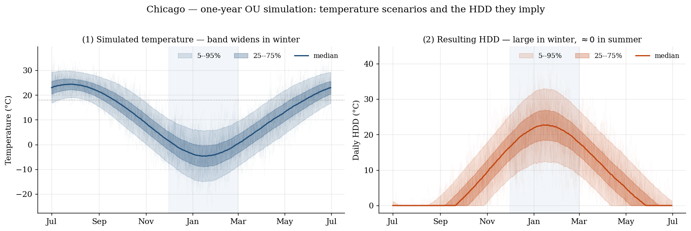
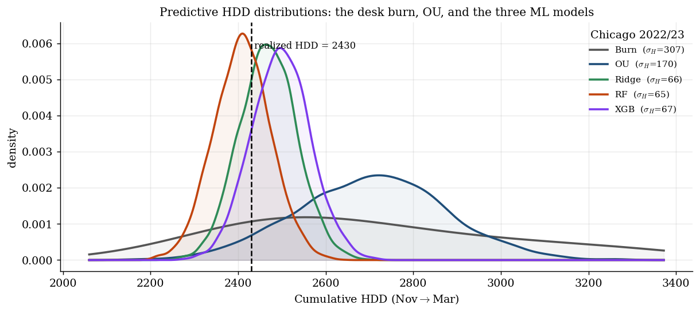

# Weather Derivatives: Temperature Models & Climate-Index Distributions

**Predicting the full distribution of a cumulative climate index (winter Heating Degree Days) from daily temperature, then putting it to work in two settings: weather-derivative pricing and natural-gas volatility.**

🌬️ **Live app: [Boreas, an interactive weather-derivatives pricing desk](https://huggingface.co/spaces/nayelsdk1/boreas-weather-derivatives)**

📄 **Reports (PDF):** [Main report](report/main_en.pdf) · [Extension: gas volatility](report/extension_en.pdf)

The object this project predicts is not a point forecast but the **whole distribution** of the cumulative winter HDD. It is built from scratch on 70 years of daily data (1950 to 2025, 7 US cities).


*Simulated temperature over one year (left) and the daily HDD it implies (right). The band widens in winter, exactly where the index accrues.*

## Three pillars

- **Stochastic temperature model.** Daily temperature splits into a deterministic seasonal component (Fourier plus a warming trend, order chosen by AIC/BIC) and an Ornstein–Uhlenbeck residual with day-of-year volatility.
- **Machine-learning forecasting.** Ridge, Random Forest and XGBoost on the deseasonalized residual. Monte-Carlo scenarios come from recursive forecasts plus bootstrapped out-of-sample errors, which turn each point forecaster into a full index distribution.
- **Pricing contest.** The same winter HDD call, priced by our models across 7 cities and 5 test winters.

## What the distribution is for

The distribution is the deliverable, and this project puts it to work in two settings: **pricing** weather derivatives (an HDD option's price is set by the dispersion of the index, not its level) and **natural-gas volatility** (winter cold anomalies drive a GARCH-X on Henry Hub returns).

Here is an example of the HDD distribution across the different models:


*Since a user prices or hedges against that spread, the model choice matters through its dispersion far more than through its mean.*

## Repository

```
0_Data_Analysis/   Exploratory analysis, data splitting, descriptive statistics
1_Temperature/     1_OU (dynamics, volatility, OU process), 2_ML (features, forecasts, evaluation), 6_Pricing.ipynb (the contest)
2_Gaz_Naturel/     Henry Hub stylized facts, Schwartz–Smith + Kalman filter, GARCH
3_Couplage/        Weather to gas-volatility coupling (GARCH-X)
report/            Full research reports (FR and EN) plus the gas-volatility extension
```

The notebooks are **read-only showcases** (executed outputs included) that import from a private `src/` package. The production pipeline and the Boreas app are intentionally kept private.

## Data

NOAA GHCN daily temperatures (7 US cities, 1950 to 2025) and GEFS reforecasts, Henry Hub spot (FRED), gas storage and consumption (EIA), NG futures (Databento). No raw vendor data is redistributed.

## Author

**[Nayel Benabdesadok](https://www.linkedin.com/in/nayel-benabdesadok/)**, ENSAE Paris (IP Paris) student. Do not hesitate to reach out if you have any questions or spot any errors. More on my [personal site](https://nayelsdk.github.io/).
